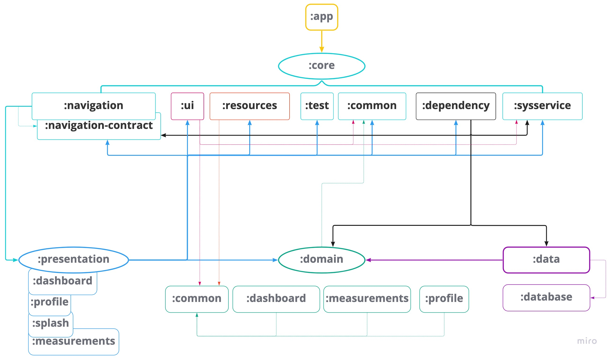

# vitals-tracker

Simple android application for tracking some of the health data. 

The main purpose of the app is to learn and try out some of the libraries and techniques of android development in a "safe" environment (not in production used application).

# Overview of the app's tech-stack

* Multi-module application
* Gradle Kotlin DSL
* Clean Architecture
* MVI
* Kotlin
* Kotlin-coroutines
* Android Jetpack libraries
* Android Jetpack-Compose
* Unit tests

_Full list of used libraries could be found [here](./includeBuild/configuration/src/main/kotlin/dependencies/Deps.kt)_

# Dependencies graph

# FYI

#### Some of the design decisions or code quality are questionable. That's ok for such project which main goal is to study something new and to test out different approaches in the development.

Next repos were used as huge source of inspiration:
* https://github.com/Digitaler-Impfnachweis/covpass-android
* https://github.com/ErickSumargo/Dads

The project was completely developed outside working hours.  

Will work on the project continue? - Can't answer due to the lack of free time  
Will it have new features in future? - Can't answer due to the lack of free time

# Some of the examples of app's usage

 
Create profile                   |  Dashboard                      |  Create record                         |  Measurement overview                          |
:-------------------------------:|:-------------------------------:|:--------------------------------------:|:----------------------------------------------:|
        |      |  | 

